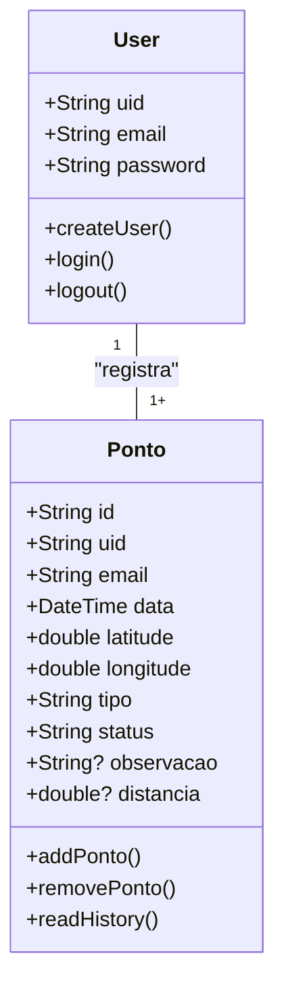
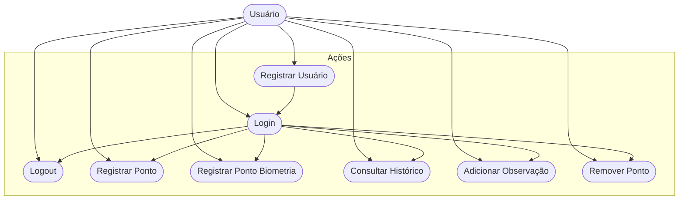
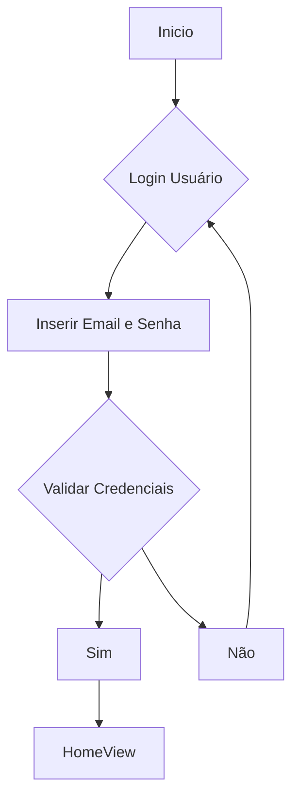

# Registro de Ponto - Somativa
Aplicativo Mobile em Flutter para registro de ponto de funcionários utilizando **geolocalização**, **biometria** e **Firebase**. 

## Objetivos
- Registrar pontos de entrada e saída de funcionários automaticamente quando estiverem próximos ao local de trabalho.  
- Autenticar usuários via NIF/email e senha ou reconhecimento facial (biometria).  
- Armazenar registros de ponto no Firebase com data, hora e localização.  
- Permitir consulta de histórico completo de registros de ponto por usuário.  
- Implementar boas práticas de UI/UX e arquitetura Flutter organizada.

## Levantamento de Requisitos do Projeto

### Funcionais
- Login e Registro de Usuário via Firebase Authentication  
- Registro de ponto com validação de geolocalização (até 100m do local de trabalho)  
- Autenticação por biometria  
- Visualização do histórico de pontos com filtros por data ou tipo de registro  
- Possibilidade de remover registros ou adicionar observações  

### Não Funcionais
- Interface amigável e responsiva em tons de verde  
- Integração em tempo real com Firebase Firestore  
- Armazenamento seguro de dados do usuário  
- Compatível com Android 

## Recursos do Projeto
- Flutter 
- Firebase 
- Geolocalização com Geolocator  
- Biometria com Local Authentication  
- VS Code  

## Diagramas

### 1. Classes
Demonstra o funcionamento das entidades do sistema:

- **User**
  - email  
  - password  
  - uid  
  - login()  
  - create()  
  - logout()  

- **Ponto (Model)**
  - id: String  
  - uid: String  
  - email: String  
  - data: DateTime  
  - latitude: double  
  - longitude: double  
  - tipo: String ("entrada" / "saida")  
  - status: String ("registrado", "pendente", "manual")  
  - observacao: String?  
  - distancia: double?  

- **Controllers**
  - AuthController → gerencia login, registro e logout  
  - BiometricsController → gerencia autenticação biométrica  
  - LocationController → gerencia permissões e captura de localização  
  - RpdbController → gerencia CRUD do modelo Ponto  

### 2. Uso
Ações que os Atores podem fazer:

- **Usuário (Employee)**:
  - Registrar conta  
  - Login  
  - Logout  
  - Registrar ponto (entrada/saída)  
  - Registrar ponto via biometria  
  - Consultar histórico de pontos  
  - Adicionar observação em um registro  
  - Remover registro de ponto  

### 3. Fluxo
Determina o caminho percorrido pelo ator para executar uma ação: **Login**

- **Ação de Login**: o usuário insere suas credenciais e, se validadas, acessa a tela principal (HomeView).

### Codificação

